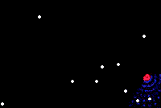
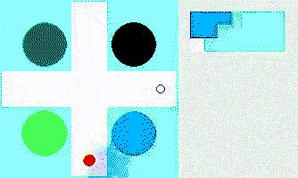
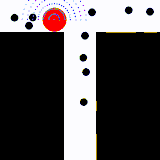

# memory-evolution

This library is coded to replicate in a virtual environment and with an 
artificial agent, neuroscience experiments commonly done with mice to address 
spatial representations, orientation, navigation, foraging, and spatial memory. 
The library is developed to enrich the instruments available to the computational neuroscience 
research community, to set clear and shared benchmarks, testing of new ideas, designing experiments, 
and leading to better computational models.

Environments are based on the OpenAI `gym` module, to be easily used with several algorithms
and different models, and then compare results and create good benchmarks for the scientific field.
Moreover, these environments are modular, parameterizable and inheritable for further class design
customization. By being easily adapted to one needs, they can generate interesting benchmarks 
also for other cognitive properties, leading to the expansion of the capabilities of artificial 
networks and expansion of our knowledge of cognitive processes.

This module proposes also some default agents to use: a base class to inherit for creating custom agents, 
a random agent which can be used as the worst performance benchmark, and several agents based on 
neuroevolution. These latter agents evolve their neural networks (both the structure, i.e. topology, 
and connections strength, i.e. weights) with evolutionary algorithms and can be 
used to study which neural components emerge by this process when interaction with a particular environment.

Several experiment can be designed using this module. An example can be found in the main files present 
in this GitHub repository, written as part of the Master's thesis of the author of this library, 
which implement an experiment to test neural correlates of allocentric and egocentric spatial representations 
in evolved artificial agents.


## Prerequisites

Install all dependencies in a conda environment (e.g., `myenv`).  
Run the following code in a terminal:  

```bash
conda create -n myenv -c default -c conda-forge 'python>=3.9' numpy pandas shapely tqdm matplotlib imageio dill  python-graphviz pydot
conda activate myenv && python -m pip install -U gym pygame neat-python
# [-U]  # to update
# gym[all]  # to install all
python --version  # check that python version is equal or greater then 3.9
exit  # restart the terminal to have everything in place
```

Then, when using the library, run your code in the conda environment you have just created.  

```bash
conda activate myenv
```

## Usage

#### Example foraging (BaseForagingEnv):



#### Example plus-maze (RadialArmMaze):



#### Example t-maze (TMaze):



___

#### Example foraging:

```python3
import os
import logging

import memory_evolution
from memory_evolution.agents import RandomActionAgent, RnnNeatAgent, CtrnnNeatAgent, ConstantSpeedRnnNeatAgent
from memory_evolution.envs import BaseForagingEnv, MazeForagingEnv, TMaze, RadialArmMaze
from memory_evolution.evaluate import evaluate_agent


env = BaseForagingEnv()
# env = RadialArmMaze()


local_dir = os.path.dirname(__file__)
config_path = os.path.join(local_dir, 'config-rnn')

agent = RnnNeatAgent(config_path)

agent.set_env(env)
logging.info("Evolving...")
winner, stats = agent.evolve(500, render=False,
                             parallel=True,
                             view_best=False,
                             stats_ylog=False)
logging.info("Evolution finished.")

# render the best agent:
evaluate_agent(agent, env, episodes=3, render=True,
               save_gif=True,
               save_gif_name=os.path.join('logs/', 'frames.gif'))

env.close()
```

#### Example plus-maze:

```python3
import logging
import os

import neat
import numpy as np
import pandas as pd

import memory_evolution
from memory_evolution.agents import RandomActionAgent, RnnNeatAgent, CtrnnNeatAgent, ConstantSpeedRnnNeatAgent
from memory_evolution.envs import BaseForagingEnv, MazeForagingEnv, TMaze, RadialArmMaze
from memory_evolution.evaluate import evaluate_agent, fitness_func_time_minimize
from memory_evolution.logging import get_utcnow_str
from memory_evolution.utils import COLORS

EPOCHS = 300
UTCNOW = get_utcnow_str()

max_steps = 400
corridor_width = .2
landmark_size = .25
env = RadialArmMaze(corridor_width=corridor_width,
                    window_size=200, agent_size=.075, food_size=.05, n_food_items=1, max_steps=max_steps,
                    vision_depth=.2, vision_field_angle=135, vision_resolution=3,
                    vision_channels=3, vision_point_radius=.04,
                    agent_color=COLORS['cyan'],
                    background_color=np.asarray((0, 0, 0), dtype=np.uint8),
                    outside_color=np.asarray((255, 0, 0), dtype=np.uint8),
                    food_color=np.asarray((0, 200, 55), dtype=np.uint8), food_visible=False,
                    random_init_agent_position=((.5, .1), (.5, .9), (.1, .5),),
                    init_food_positions=((target_pos := (.9, .5)),),
                    landmark_size=landmark_size,
                    init_landmarks_positions=((0.25, 0.25), (0.75, 0.25), (0.25, 0.75), (0.75, 0.75)),
                    landmarks_colors=(
                        np.asarray((255, 0, 255), dtype=np.uint8), np.asarray((255, 255, 0), dtype=np.uint8),
                        np.asarray((255, 127, 127), dtype=np.uint8), np.asarray((255, 255, 255), dtype=np.uint8),
                    ),
                    )
    
# ----- AGENT -----

local_dir = os.path.dirname(__file__)
config_path = os.path.join(local_dir, 'config-cs-rnn')

# select Phenotype:
Phenotype = ConstantSpeedRnnNeatAgent

# set Phenotype attributes (overwrite default values, e.g. fitness and evaluate_agent params):
Phenotype.fitness_func = fitness_func_time_minimize
Phenotype.eval_num_episodes = 20
Phenotype.eval_episodes_aggr_func = 'mean'

# construct agent:
agent = Phenotype(config_path)

# ----- MAIN LOOP -----
# Evolve, interact, repeat.

# Rendering settings:
render, parallel, render_best = True, False, True      # local execution, render all
# render, parallel, render_best = False, True, True     # local execution, show best
# render, parallel, render_best = False, True, False    # remote execution, just save gifs

agent.set_env(env)
logging.info("Evolving...")
winner, stats = agent.evolve(EPOCHS, render=render,
                             parallel=parallel,
                             filename_tag=UTCNOW + '_', path_dir='logs/', image_format='png',
                             view_best=False,
                             stats_ylog=False)
logging.info("Evolution finished.")

# render the best agent:
evaluate_agent(agent, env, episodes=3, render=render_best,
               save_gif=True,
               save_gif_name=os.path.join('logs/', UTCNOW + '_frames.gif'))

# ----- CLOSING AND REPORTING -----

ACCURACY_TRIALS = 200

# testing the agent first arm accuracy:
accuracy = memory_evolution.evaluate.test_agent_first_arm_accuracy(
    agent, env, episodes=ACCURACY_TRIALS,
    render=False)
print(f"test_agent_first_arm_accuracy (n={ACCURACY_TRIALS}): {accuracy}")

# test general target-reached rate (to discriminate bad v.s. border-follower v.s. allocentric/egocentric successful agents):
target_reached_rate = memory_evolution.evaluate.test_agent_target_reached_rate(
    agent, env, episodes=ACCURACY_TRIALS,
    render=False)
print(f"test_agent_target_reached_rate (n={ACCURACY_TRIALS}): {target_reached_rate}")

# fitness:
print(f"BestGenomeFitness: {winner.fitness}")

env.close()
```


